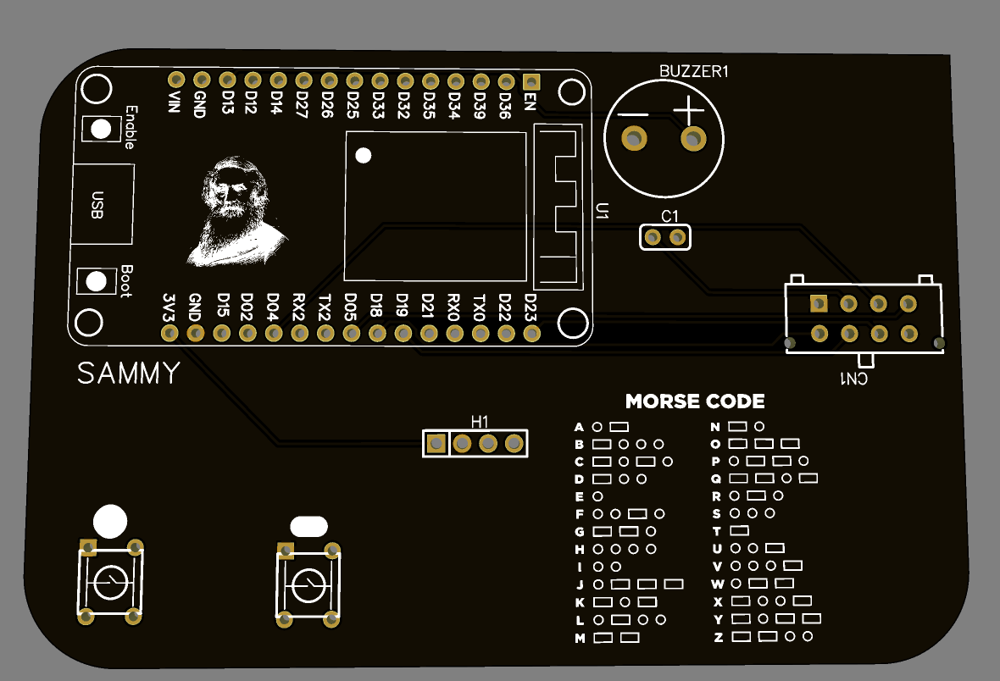

SAMMY is a very easy to use device. when setting up the device simply solder the parts listed in the bill of materials to the marked spots on the pcb.

IMPORTANT!!!! when you flash the code onto the esp32 you need to change the device id. if you dont it wont be able to communicate with other devices.

how it works!: SAMMY takes your morse code and translates it into readable characters that get sent out in packets across 2.4ghz radio waves to other sammy devices, you can be paired with up to 5 people at a time you only need to change the device id in the code.

*not as important* the code is completely changeable. theres a built in morse code library but you can EASILY add your own characters/morse patterns using the morsemap. seriously if there is anything you want to change about this device you should its! have fun with it if you build it. the base device is made just to share morse code but all you have to do is change the code to make it do whatever you want. you could use it to wirelessly play tic tac toe or rock paper scissors. you could use it as a chirp tune player. it can probably run doom. the world is your oyster i tried to make this thing very changeable.

ALSO!! i made this project for a challenge called stardance put on by hackclub, if youre interested in engineering or computer science (and are ages 13-18) go check them out here
stardace: https://stardance.hackclub.com/home
hackclub: https://hackclub.com/

flash the code on the esp32 using the arduino ide (sammycode.ino is the code)
REQUIRED LIBRARIES:
-RF24 by TMRh20
-Adafruit SSD1306 by adafruit
-Adafruit GFX Library by adafruit

  

ps. try holding both buttons at once. tapping dot 10 times and spelling sos. some fun easter eggs
